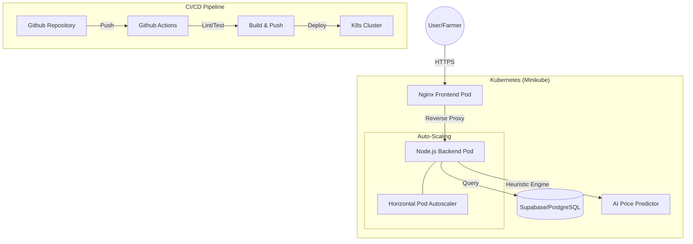

# 🥦 AgroLink: Professional Farm-to-Table DevOps Platform


AgroLink is a production-grade, fully automated MERN stack platform that connects farmers directly with consumers. Built with a focus on **DevOps excellence**, the system features automated CI/CD pipelines, container orchestration, and an **AI-powered Crop Price Predictor**.

## 🏗️ System Architecture



## 🚀 Key Features
- **Direct Farm-to-Table**: Seamless commerce between farmers and consumers.
- **AI Price Prediction**: Real-time harvest value estimation using seasonal trends.
- **Auto-Scaling Infrastructure**: Kubernetes-managed scaling for high-traffic handling.
- **Automated CI/CD**: Seamless delivery from code push to production.

## 🛠️ DevOps Stack
- **Frontend/Backend**: React, Express, Node.js
- **Database**: Supabase (PostgreSQL)
- **Containerization**: Docker (Multi-stage builds)
- **Orchestration**: Kubernetes (Minikube, HPA)
- **IaC**: Terraform, Ansible
- **CI/CD**: GitHub Actions

## 📖 Getting Started

### 1. Prerequisites
- Docker, Minikube, Terraform, Ansible
- A Supabase account

### 2. Quick Deploy (Local)
```bash
# Clone the repository
git clone https://github.com/your-repo/agrolink.git
cd agrolink

# Deploy infrastructure
cd terraform && terraform init && terraform apply -auto-approve

# Deploy app
cd ../ansible && ansible-playbook deploy-k8s.yml
```

### 3. CI/CD Configuration
Configure these **GitHub Secrets** for the pipeline:
- `DOCKERHUB_USERNAME`, `DOCKER_HUB_TOKEN`
- `SUPABASE_URL`, `SUPABASE_KEY`
- `JWT_SECRET`

## 🤝 Contributing
Please read [CONTRIBUTORS.md](./CONTRIBUTORS.md) for our feature-branching strategy and code standards.

---
*Developed for Excellence in DevOps Automation.*
