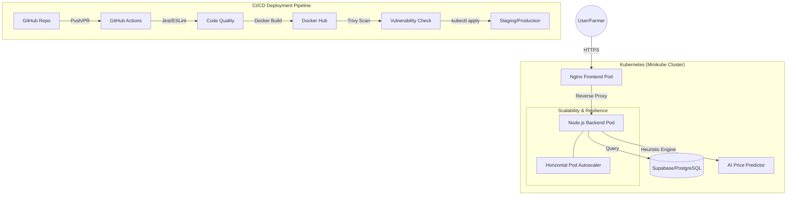

# 🌱 AgroLink: DevOps-Driven Farm-to-Table Platform


AgroLink is a production-grade, microservices-oriented platform connecting farmers directly with consumers. Originally a monolithic application, it has been completely modernized utilizing a robust **DevOps, cloud-native architecture**.

## 🏗️ System Architecture



## 🛠️ Technology Stack
* **Application Core:** React (Vite), TailwindCSS, Node.js, Express.js
* **Database:** Supabase (PostgreSQL)
* **Containerization:** Docker (Multi-stage builds)
* **Orchestration:** Kubernetes (Minikube)
* **Infrastructure as Code:** Terraform, Ansible
* **CI/CD & Security:** GitHub Actions, Trivy Security Scanner, ESLint, Jest
* **Monitoring & Observability:** Prometheus, Grafana

---

## 🔀 Version Control & Collaboration Strategy

We implement a strict professional Git Workflow to maintain codebase integrity:

*   **`main` branch:** Production-ready code only.
*   **`develop` branch:** Integration branch for merging combined features.
*   **`feature/*` branches:** Dedicated branches for isolated development (e.g., `feature/frontend`, `feature/ai-predictor`).
*   **Pull Requests (PRs):** All merges require descriptive PRs and code review approvals.
*   **Commit Standards:** Strict adherence to Conventional Commits format (`feat:`, `fix:`, `chore:`, `docs:`).

---

## 🚀 Execution Guide & Automated Deployment

### 1. Prerequisites
Ensure you have the following installed on your local control plane:
- `docker`, `minikube`, `kubectl`, `terraform`, `npm`

### 2. Automated Testing Pipeline
Before any containerization occurs, run the quality gates locally:
```powershell
cd server
npm install
npm test
```
*Validates API routes, JWT security, and HTTP status handling.*

### 3. Deploying the Kubernetes Infrastructure
Start your cluster and auto-generate the underlying dependencies:
```powershell
minikube start

# Validate Infrastructure state
cd terraform
terraform init
terraform apply -auto-approve
```

### 4. Deploying the Application
Automate the rollout of the Deployments, Services, and ConfigMaps:
*(Note: If Ansible is unavailable on Windows, manual application runs exactly the same logic)*
```powershell
kubectl apply -f k8s/
```

### 5. Accessing the Live Platform
Expose the frontend service to the browser via NodePort:
```powershell
minikube service frontend -n agrolink-prod
```
*Your browser will automatically open the live AgroLink application.*

---

## 📈 Observability & Monitoring

The system continuously monitors its own health using Prometheus and visualizes compute usage via Grafana.

**To view the monitoring dashboard:**
```powershell
# Port forward Grafana to localhost
kubectl port-forward -n agrolink-monitoring svc/grafana 3001:3000
```
Then navigate to `http://localhost:3001` (Login: `admin` / `admin`).  
*Here you can view Pod memory, CPU limits triggered via Horizontal Pod Autoscaler (HPA), and application uptime.*

---
*Developed for Excellence in DevOps Automation.*
